# ProtonMail Material Themes

ProtonMail themes inspired by material design guidelines.

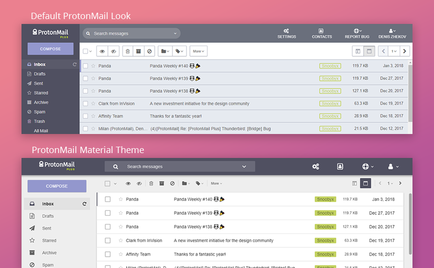

## Install

### 1. Choose a theme
Click on the theme and copy the CSS from the raw file.

[**ProtonMail** 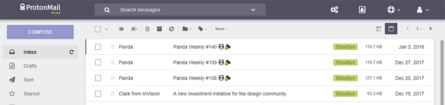](https://raw.githubusercontent.com/Snoobyx/protonmail-material-themes/master/css/protonmail_material.css)

[**Inbox** 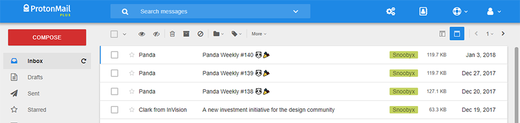](https://raw.githubusercontent.com/Snoobyx/protonmail-material-themes/master/css/protonmail_inbox.css)

[**Gmail** 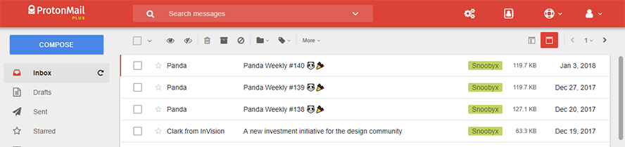](https://raw.githubusercontent.com/Snoobyx/protonmail-material-themes/master/css/protonmail_gmail.css)

### 2. Paste the CSS in your ProtonMail
In ProtonMail go to Settings > Appearance and paste the CSS you copied into "Custom theme" field. Click "Save" and enjoy the new modern look of your inbox

## Features
The themes changes not only colors and shapes, but some of the layout and behavior (as far it is possible to be done with simple CSS).

#### Advanced Search
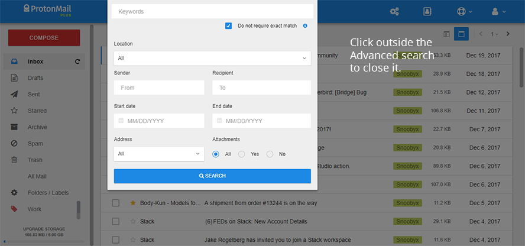

### Column & Rows Layouts
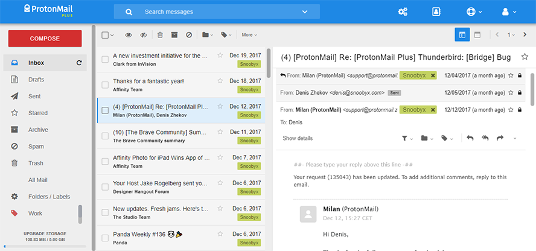
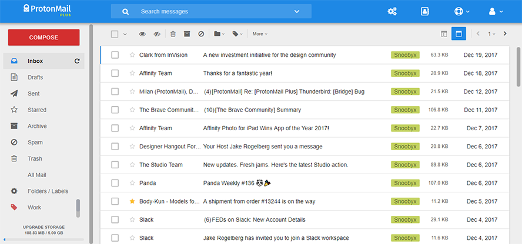

#### Contacts
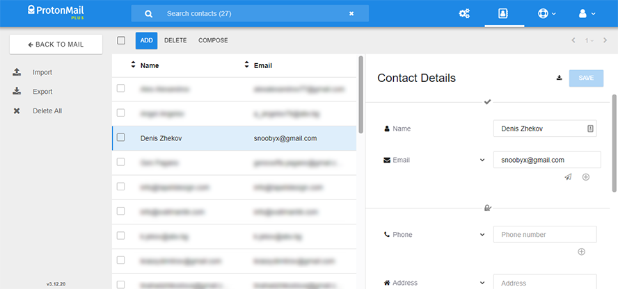

#### Settings
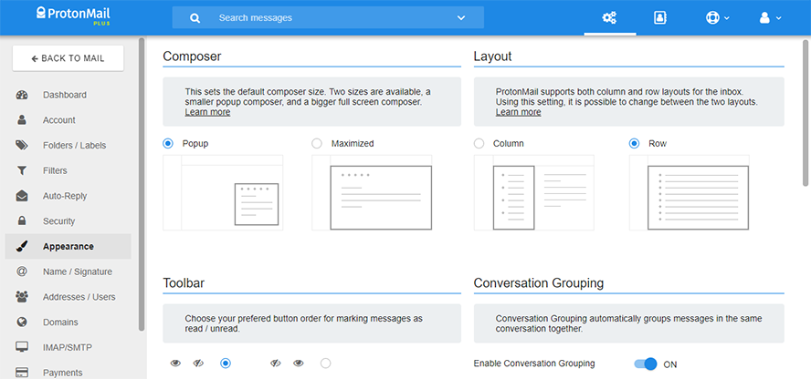

#### Composer
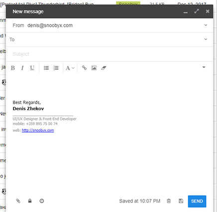

#### Mobile
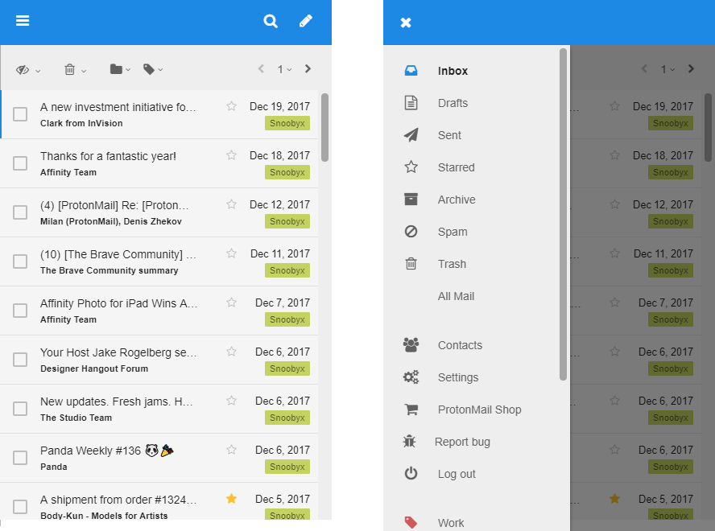

Labels, folders, buttons, switches and many more are redesigned.

## Build your own theme
Clone the project:
```bash
git clone https://github.com/Snoobyx/protonmail-material-themes.git
```
Go to scss folder
```bash
cd scss
```

Create new scss file with your theme's name.
```bash
touch example.scss
```
Add the colors you want to change and add ``@import "theme/_default.scss";`` at the end of the file.
#### Example:
```scss
$primary-color: #1E88E5;
$secondary-color: #D32F2F;

@import "theme/_default.scss";
```
Save the file and run compass compile
```bash
compass compile
```
Your new theme should appear in the css folder, copy the content to Settings > Appearance  in ProtonMail and you're done!

> You can check which variables you can add and change in your theme in [scss/theme/_default.scss](/scss/theme/_default.scss)


## Feedback
If you see something wrong or you want some feature please open an issue. If you want to fix or add something yourself feel free to make a pull request.


## ToDo

* Dark themes